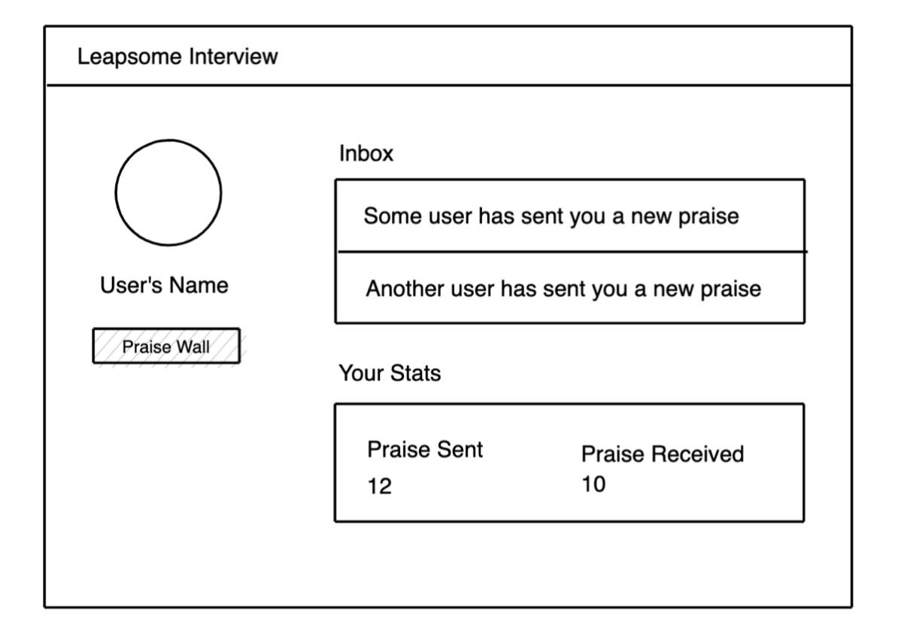
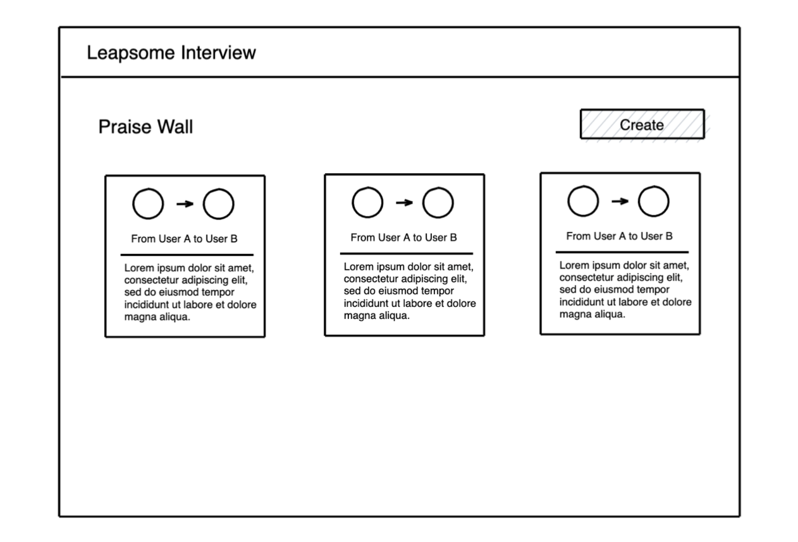
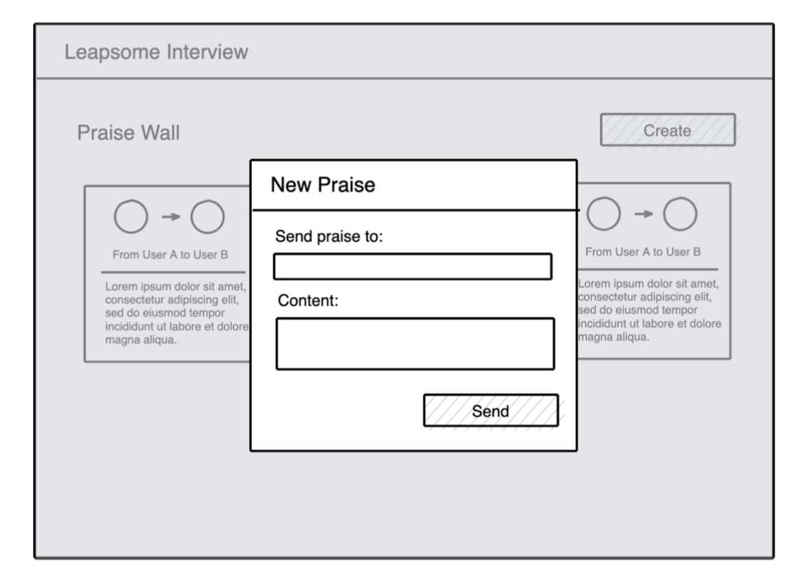

# Leapsome Case Study

At Leapsome, we believe that engineers should have a great understanding of the business and the product as well as tech expertise as you will work closely with other teams and customers.

We value creativity, business sense and engineering skills alike.

For the product-focused section, answers can be presented in any format (document, presentation, photographed sketches, etc ...).

Please attach results of your **product case solution in a separate PR** to this repository.

Thanks a lot for your time!

# Product-focused section
This section should not be taking you more than **1.5 hours** to complete. Please try to limit yourself to that timeframe.

## Description
One of the core features of Leapsome is praise and continuous feedback.

For the sake of simplicity, let's imagine a product that allows users to send public praise to each other.

A praise is simply some text content that is sent from a user to another user.

We can quickly do a wireframe of such product as follows:

User's profile


Praise wall


New praise modal

To strengthen company values, some of our customers suggested we integrate the possibility to attach badges to those praises.

You can imagine, for example, a company having 5 core values, each represented by a badge that can be awarded to a user when sending them a praise.

- From a product perspective, which changes to the product would you implement to accommodate this feature?
- From a technical perspective, please elaborate on the API and the data model needed to enable this feature.
- In which ways could this feature potentially evolve?
  For example, are there ways to generalize the concept of "badges" to serve other purposes? Are there ways to gamify the experience of sending praise?


# Technical section

This section should not be taking you more than **2.5 hours** to complete. Please try to limit yourself to that timeframe.

## Description

This repository contains some basic code implementing a very basic public praise functionality.

The tech stack is similar to what we use for the Leapsome webapp, even though the codebase _per se_ is fairly different.

For simplicity, we have removed all authentication code. Hence, you will be automatically "logged in" as the first user in the database. If you have already completed the product section of the case study, you will notice that this repository implements a very similar webapp as the one described in that section.

## Tasks

Here is a list of tasks you have to perform:

### Review the open PR

There is an open pull request on this repository. It has been open by one of your (potentially) future colleagues!

Please take some time to review the pull request.

### Open a PR with your proposed fix to the open issue

The same colleague has also opened an issue.

Please look at the issue and open a new pull request with your proposed solution.

## Getting Started

### Prerequisites

To be able to run this repository on your machine, you will need to have the following installed:
- NodeJS (> 14)
- Docker

### Installing Dependencies

To install all needed Node and Vue dependencies, you can run:

```
npm install
```

### Copy env variable file

The code rests upon certain environemt variables that are expected to be declared inside a `.env` file.

Those variables are defined (with sensible defaults) in `.env.sample`, so you can copy that file as such:

```
cp .env.sample .env
```

### Database

You can either use a local or remote MongoDB to work on the case study, or you can use Docker to create a local instance.

To do so, you first need to build the image with:
```
make build
```

You can then start the service with:
```
make db
```

#### Pre-populate database
If this is your first time running the database service, make sure to manually run
```
npm run migrate:up
```
to pre-populate the database with sensible data.

You can also decide to manually pre-populate the database as you see fit.

## Development

Once everything is installed and set up, you can start the project in development mode by running:
```
npm run dev
```

This will automatically watch any changes made to both the backend and frontend code, but you will still need to manually refresh your browser to fetch the latests static assets (there is no hot-reloading).

## Running Tests

You can run unit test by running
```
npm run test
```

Note that you can run only backend or frontend unit tests by running respectively:
```
npm run test:be
```
```
npm run test:fe
```

## Questions?

If you have any questions, please feel free to reach out to us by email! Good luck! :) 
